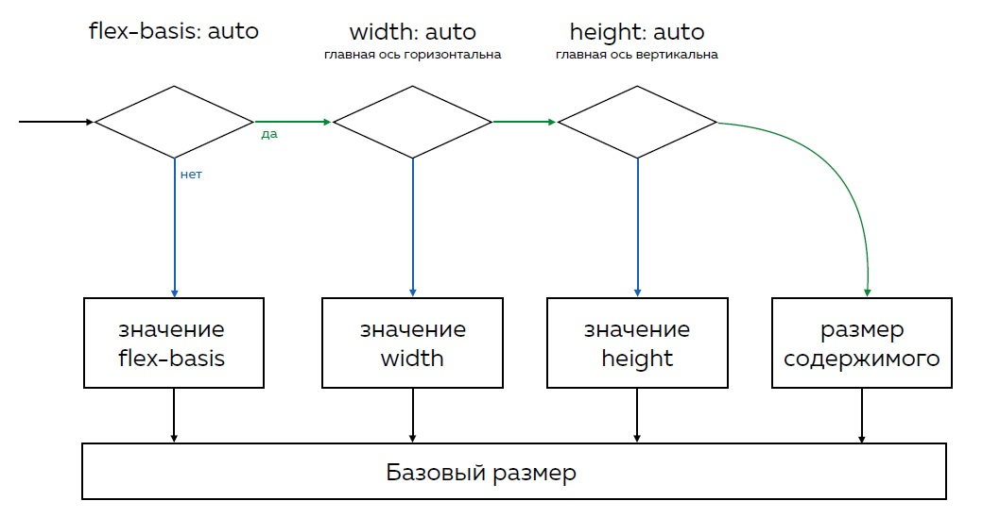

# Flexbox

Для начало вот список полезных ссылок, которые стоит изучить:  
1. Единственный источник истины [спецификация](https://www.w3.org/TR/css-flexbox-1/) (eng)  
2. Сборник быгов [flexbugs](https://github.com/philipwalton/flexbugs)  
3. Очень полезные курсы от htmlacademy [курс 1](https://htmlacademy.ru/courses/96) и [курс 2](https://htmlacademy.ru/courses/113) (платно)  
4. Визуальный гайд по [flexbox](https://medium.com/@js_tut/the-complete-css-flex-box-tutorial-d17971950bdc) (eng)  
5. Хорошая браузерная игра, позволяет вспомнить flexbox [flexboxfroggy](http://flexboxfroggy.com/#ru)  

**Значения по умолчанию** [тык](https://www.w3.org/TR/css-flexbox-1/#property-index)  

#### Расчет разметов flex-элементов

1. **Определение базового размера.**  
Сначала за базовый размер принимается значение свойства `flex-basis` (либо третье значение свойства `flex`). Если оно не задано или имеет значение `auto`, то значение свойства width/height (в зависимости от направления главной оси). Если и они не заданы или имеют значение `auto` - то размер по контенту. Вот наглядная схема выбора базового размера (позаимствована из презентации html academy):

Стоит также помнить что в расчете базового размера участвуют свойства `border` и `padding` (для облегчения можно воспользоваться свойством `box-sizing`). 
2. **Перераспределение свободного места**  
2.1. После происходит перераспределение свободного пространства элементам со значениями свойства `flex-grow` больше 0 (0 - значение по умолчанию).  
2.2. Если есть отрицательное пространство - тогда его делял элементы со значением свойства `flex-shrink` больше 0 (стоит помнить что значение по умолчанию 1).  
2.3. Далее применяется `margin` во всех направлениях. Стоит помнить что `margin` "съедает" все пространство - после чего выравнивание "ломается" (пункты 2.4 и 2.5)!   
2.4 Применяется выравнивание по главной оси `justify-content`  
2.5 Применяется выравнивание по поперечной оси `align-items`   
3. **Пременение ограничений размеров**

#### Расчет flex-grow  
#### Расчет flex-shrink
